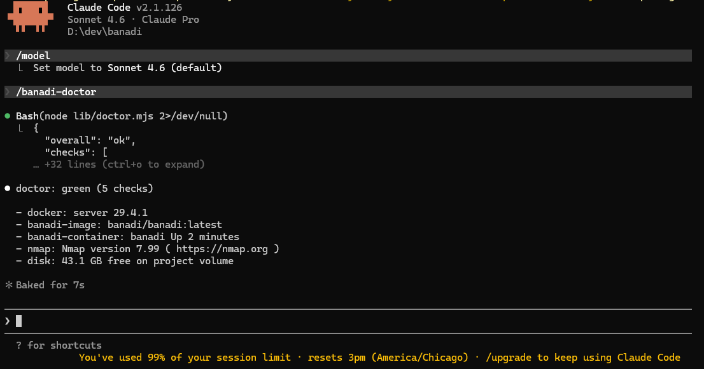
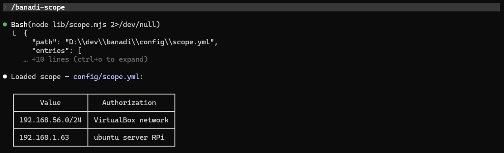
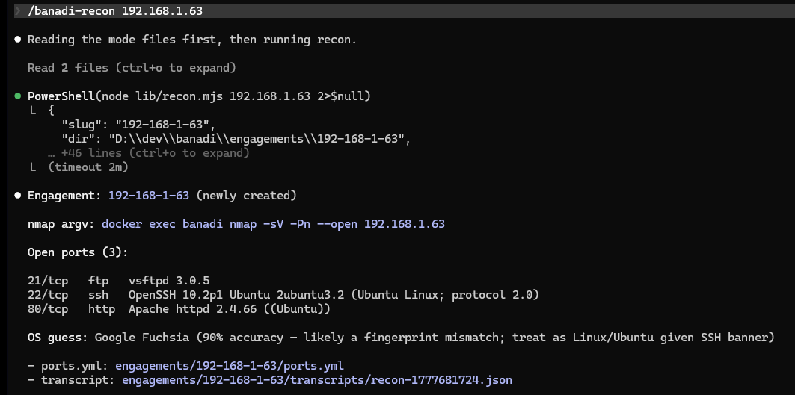
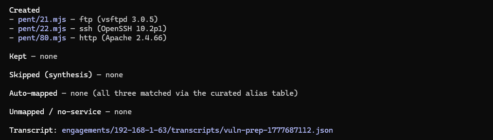
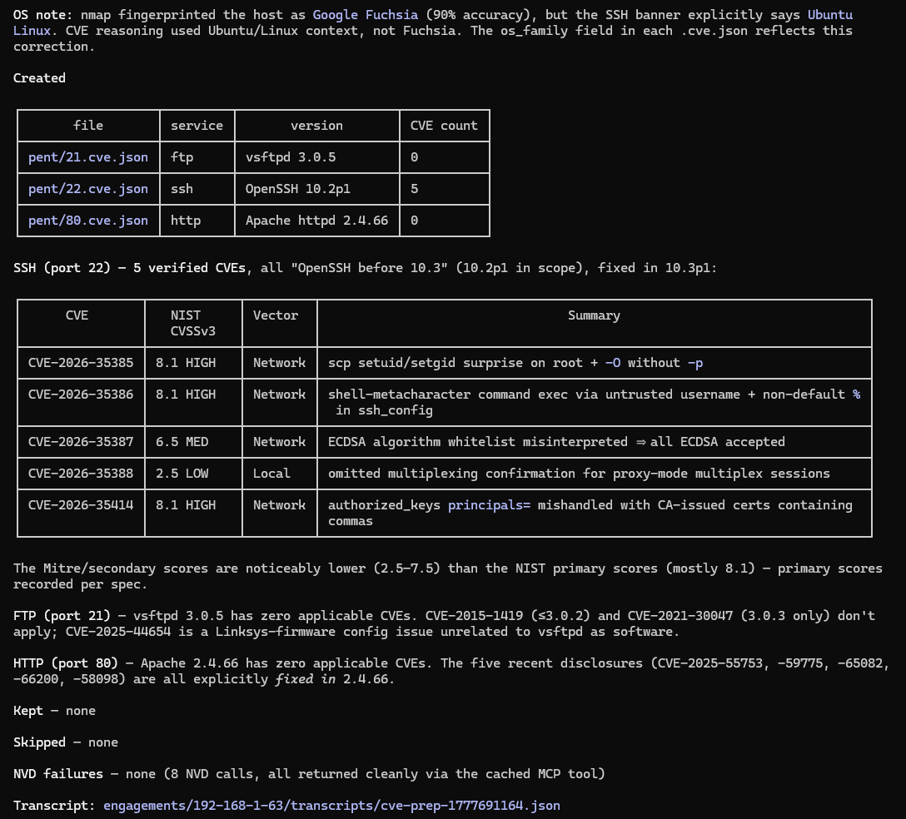
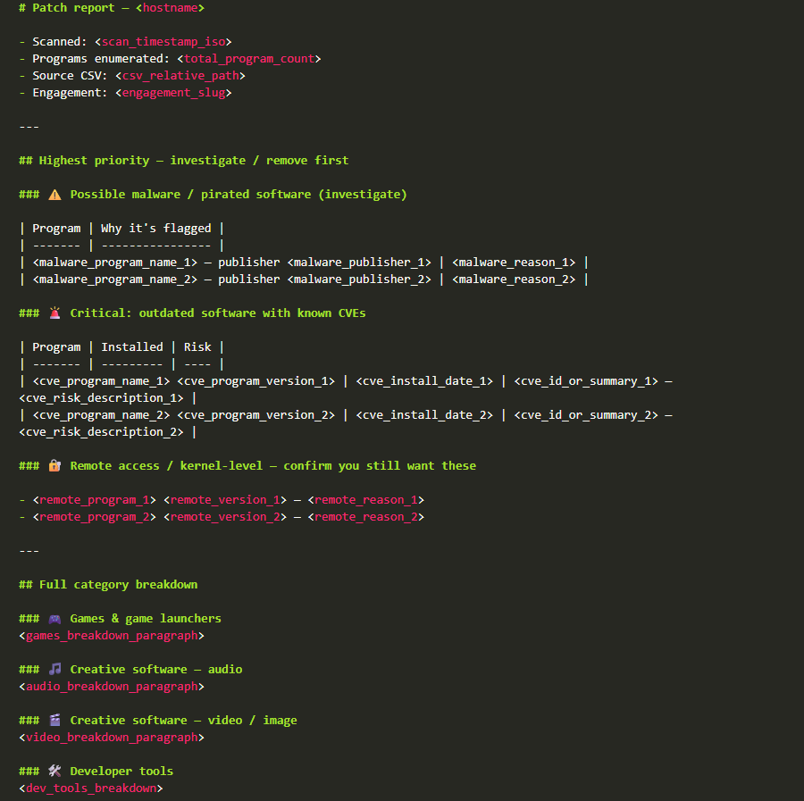

# banadi

AI-powered pentesting and vulnerability triage framework.

After recognizing LLM tooling through [pentagi](https://github.com/vxcontrol/pentagi) and Claude Code orchestration through [career-ops](https://github.com/santifer/career-ops), I created banadi. It combines Claude Code, Dockerized security tooling, CVE intelligence, and LLM-assisted analysis into a modular offensive security workflow.

---

## Commands

### `/banadi`
Displays the list of available commands.

### `/banadi-doctor`
Verifies Docker container, MCP servers, and LLM reachability are green.



### `/banadi-scope`
Prints current list of available targets in `config/scope.yml`.



### `/banadi-recon <target>`
Runs an nmap scan on the target in the Docker container. Logs ports, OS estimate, and transcript.



### `/banadi-vuln`
Sources [hackviser.com](https://hackviser.com/) for pentesting information/guidance per port.



> See [hackviser's document on port 22 (SSH)](https://hackviser.com/tactics/pentesting/services/ssh) for an example.

### `/banadi-cve`
Uses LLM reasoning/history to identify CVE IDs for the version banner and port service. Uses the NVD REST API to capture information and further guidance.



### `/banadi-patch`
Triages a Windows host's installed-program inventory. Uses LLM reasoning/history to identify CVE IDs, malware, and remote-access concerns, and generates a `report.md` from a template.



> `report.md` template. Results vary.

---

## Quick start

Prerequisites: Docker Desktop (or any Docker daemon) running, Node.js ≥ 20.6, and Claude Code.

```bash
cp config/scope.example.yml config/scope.yml   # edit your in-scope targets
npm install
bash scripts/banadi-up.sh                      # Linux/macOS/WSL: builds banadi/banadi:latest and starts the kali container
# Windows + Docker Desktop:
#   powershell -ExecutionPolicy Bypass -File scripts/banadi-up.ps1
claude
```

Then in Claude Code: `/banadi-doctor`


See [planroom/PLAN.md](planroom/PLAN.md) for the canonical spec. I hope my planning methods help you with your apps